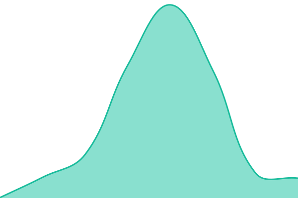

# [📈 Live Status](https://status.whitney.rip): <!--live status--> **🟩 All systems operational**

This repository contains the open-source uptime monitor and status page for [PWS](https://whitney.rip), powered by [Upptime](https://github.com/upptime/upptime).

<!--start: status pages-->
<!-- This summary is generated by Upptime (https://github.com/upptime/upptime) -->
<!-- Do not edit this manually, your changes will be overwritten -->
<!-- prettier-ignore -->
| URL | Status | History | Response Time | Uptime |
| --- | ------ | ------- | ------------- | ------ |
|  [PWS Homepage](https://www.whitney.rip) | 🟩 Up | [pws-homepage.yml](https://github.com/whitney-server/upptime/commits/HEAD/history/pws-homepage.yml) | 

 443ms
     
 | 

<a href="https://whitney-server.github.io/upptime/history/pws-homepage">96.02%</a>
    

|  [Jake Runyan Portfolio](https://jake.runyan.dev) | 🟩 Up | [jake-runyan-portfolio.yml](https://github.com/whitney-server/upptime/commits/HEAD/history/jake-runyan-portfolio.yml) | 

 358ms
     
 | 

<a href="https://whitney-server.github.io/upptime/history/jake-runyan-portfolio">96.07%</a>
    

|  [Jake Runyan Photography](https://jakesphotos.whitney.rip) | 🟩 Up | [jake-runyan-photography.yml](https://github.com/whitney-server/upptime/commits/HEAD/history/jake-runyan-photography.yml) | 

 327ms
     
 | 

<a href="https://whitney-server.github.io/upptime/history/jake-runyan-photography">48.89%</a>
    

|  [PWS Git](https://git.whitney.rip) | 🟩 Up | [pws-git.yml](https://github.com/whitney-server/upptime/commits/HEAD/history/pws-git.yml) | 

 369ms
     
 | 

<a href="https://whitney-server.github.io/upptime/history/pws-git">96.17%</a>
    

|  [PWS Photos](https://images.whitney.rip) | 🟩 Up | [pws-photos.yml](https://github.com/whitney-server/upptime/commits/HEAD/history/pws-photos.yml) | 

 430ms
     
 | 

<a href="https://whitney-server.github.io/upptime/history/pws-photos">96.22%</a>
    

|  [PWS Recipes](https://recipes.whitney.rip) | 🟩 Up | [pws-recipes.yml](https://github.com/whitney-server/upptime/commits/HEAD/history/pws-recipes.yml) | 

 309ms
     
 | 

<a href="https://whitney-server.github.io/upptime/history/pws-recipes">96.26%</a>
    

|  [PWS Grafana](https://grafana.whitney.rip) | 🟩 Up | [pws-grafana.yml](https://github.com/whitney-server/upptime/commits/HEAD/history/pws-grafana.yml) | 

 509ms
     
 | 

<a href="https://whitney-server.github.io/upptime/history/pws-grafana">96.31%</a>
    

|  [Jakes West Coast Site](https://jakeswestcoast.com) | 🟩 Up | [jakes-west-coast-site.yml](https://github.com/whitney-server/upptime/commits/HEAD/history/jakes-west-coast-site.yml) | 

 222ms
     
 | 

<a href="https://whitney-server.github.io/upptime/history/jakes-west-coast-site">48.89%</a>
    

|  [PWS Workouts](https://workouts.whitney.rip) | 🟩 Up | [pws-workouts.yml](https://github.com/whitney-server/upptime/commits/HEAD/history/pws-workouts.yml) | 

 326ms
     
 | 

<a href="https://whitney-server.github.io/upptime/history/pws-workouts">97.86%</a>
    

|  [PWS Applications](https://apply.whitney.rip) | 🟩 Up | [pws-applications.yml](https://github.com/whitney-server/upptime/commits/HEAD/history/pws-applications.yml) | 

 297ms
     
 | 

<a href="https://whitney-server.github.io/upptime/history/pws-applications">97.90%</a>
    

<!--end: status pages-->

[**Visit the live status website →**](https://status.whitney.rip)

## 📄 License

- Powered by: [Upptime](https://github.com/upptime/upptime)
- Code: [MIT](./LICENSE) © [Anand Chowdhary](https://anandchowdhary.com), supported by [Pabio](https://pabio.com)
- Data in the `./history` directory: [Open Database License](https://opendatacommons.org/licenses/odbl/1-0/)
