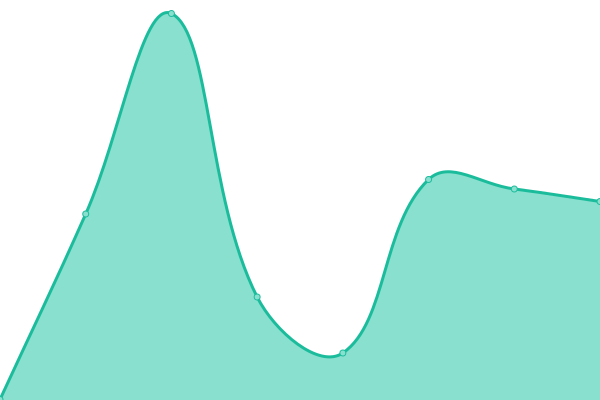

# [📈 Live Status](https://status.whitney.rip): <!--live status--> **🟥 Complete outage**

This repository contains the open-source uptime monitor and status page for [PWS](https://whitney.rip), powered by [Upptime](https://github.com/upptime/upptime).

<!--start: status pages-->
<!-- This summary is generated by Upptime (https://github.com/upptime/upptime) -->
<!-- Do not edit this manually, your changes will be overwritten -->
<!-- prettier-ignore -->
| URL | Status | History | Response Time | Uptime |
| --- | ------ | ------- | ------------- | ------ |
|  [PWS Homepage](https://www.whitney.rip) | 🟥 Down | [pws-homepage.yml](https://github.com/whitney-server/upptime/commits/HEAD/history/pws-homepage.yml) | 

 605ms
     
 | 

<a href="https://whitney-server.github.io/upptime/history/pws-homepage">99.95%</a>
    

|  [Jake Runyan Portfolio](https://jake.runyan.dev) | 🟥 Down | [jake-runyan-portfolio.yml](https://github.com/whitney-server/upptime/commits/HEAD/history/jake-runyan-portfolio.yml) | 

 265ms
     
 | 

<a href="https://whitney-server.github.io/upptime/history/jake-runyan-portfolio">99.96%</a>
    

|  [Jake Runyan Photography](https://jakesphotos.whitney.rip) | 🟥 Down | [jake-runyan-photography.yml](https://github.com/whitney-server/upptime/commits/HEAD/history/jake-runyan-photography.yml) | 

 444ms
     
 | 

<a href="https://whitney-server.github.io/upptime/history/jake-runyan-photography">99.96%</a>
    

|  [PWS Git](https://git.whitney.rip) | 🟥 Down | [pws-git.yml](https://github.com/whitney-server/upptime/commits/HEAD/history/pws-git.yml) | 

 508ms
     
 | 

<a href="https://whitney-server.github.io/upptime/history/pws-git">99.97%</a>
    

|  [PWS Photos](https://images.whitney.rip) | 🟥 Down | [pws-photos.yml](https://github.com/whitney-server/upptime/commits/HEAD/history/pws-photos.yml) | 

 440ms
     
 | 

<a href="https://whitney-server.github.io/upptime/history/pws-photos">99.97%</a>
    

|  [PWS Recipes](https://recipes.whitney.rip) | 🟥 Down | [pws-recipes.yml](https://github.com/whitney-server/upptime/commits/HEAD/history/pws-recipes.yml) | 

 389ms
     
 | 

<a href="https://whitney-server.github.io/upptime/history/pws-recipes">99.98%</a>
    

|  [PWS Grafana](https://grafana.whitney.rip) | 🟥 Down | [pws-grafana.yml](https://github.com/whitney-server/upptime/commits/HEAD/history/pws-grafana.yml) | 

 522ms
     
 | 

<a href="https://whitney-server.github.io/upptime/history/pws-grafana">99.98%</a>
    

|  [PWS GPT](https://chat.whitney.rip) | 🟥 Down | [pws-gpt.yml](https://github.com/whitney-server/upptime/commits/HEAD/history/pws-gpt.yml) | 

 397ms
     
 | 

<a href="https://whitney-server.github.io/upptime/history/pws-gpt">99.99%</a>
    

|  [Jakes West Coast Site](https://jakeswestcoast.com) | 🟥 Down | [jakes-west-coast-site.yml](https://github.com/whitney-server/upptime/commits/HEAD/history/jakes-west-coast-site.yml) | 

 2657ms
     
 | 

<a href="https://whitney-server.github.io/upptime/history/jakes-west-coast-site">100.00%</a>
    

<!--end: status pages-->

[**Visit the live status website →**](https://status.whitney.rip)

## 📄 License

- Powered by: [Upptime](https://github.com/upptime/upptime)
- Code: [MIT](./LICENSE) © [Anand Chowdhary](https://anandchowdhary.com), supported by [Pabio](https://pabio.com)
- Data in the `./history` directory: [Open Database License](https://opendatacommons.org/licenses/odbl/1-0/)
